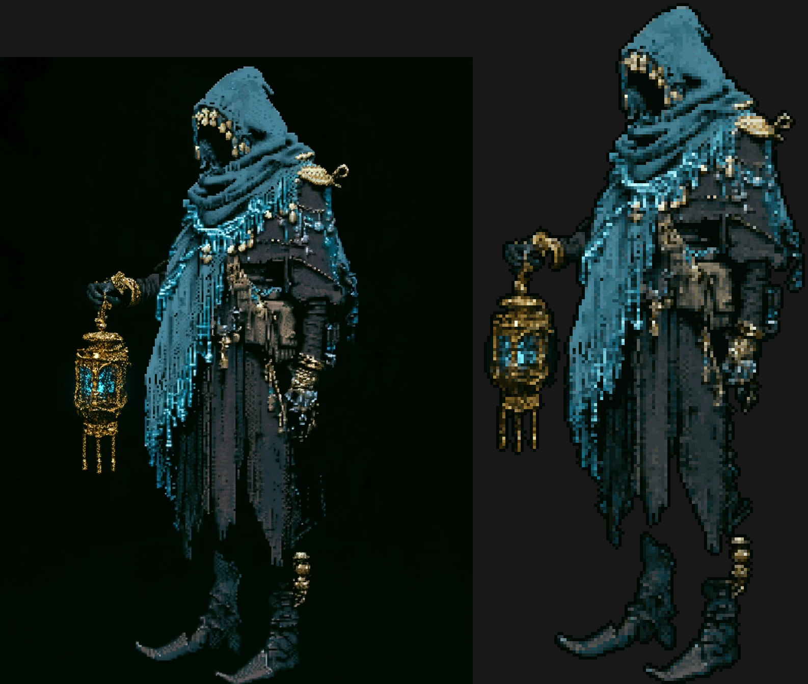

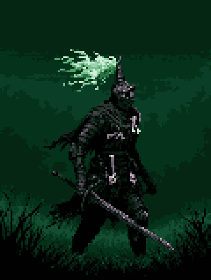

# Examples

Your three reference renders (`reference/`) run through `pixelforge` with no
manual touch-up (`output/`). Left: original AI render. Right: real pixel art
(true pixel grid, up to 96 colors, ~224 px tall — the "modern HD pixel" look; transparent cutout where wanted).

| | Before / after | Animated (procedural, from the single still) |
|---|---|---|
| Lantern wraith |  |  |
| Grave knight |  |  |
| Hearth beggar |  |  |

Commands used:

```sh
cd examples/output
pixelforge pixelate ../reference/lantern_wraith.webp -o wraith.png --remove-bg --crop --outline auto
pixelforge pixelate ../reference/grave_knight.webp  -o knight.png
pixelforge pixelate ../reference/hearth_beggar.webp -o beggar.png --max-size 160

pixelforge animate wraith.png -o wraith_anim --preset idle --effect "flicker:amount=0.12,threshold=0.5,box=0;0.3;0.4;0.7" --gif
pixelforge animate knight.png -o knight_anim --preset grass \
    --effect "sway:amplitude=2,anchor=bottom,box=0.2;0.1;0.65;0.35,wavelength=0.5,cycles=2" \
    --effect "flicker:amount=0.1,threshold=0.5,box=0.2;0.1;0.65;0.35" --gif
pixelforge animate beggar.png -o beggar_anim \
    --effect "flicker:amount=0.12,threshold=0.4,box=0.75;0.45;1;1,cycles=3" \
    --effect "breathe:amplitude=1,pivot=0.55,box=0.3;0.1;0.85;0.8" --gif
```
